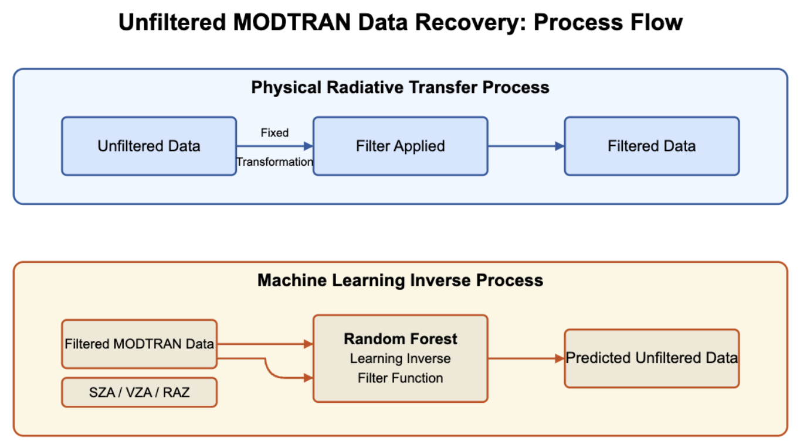
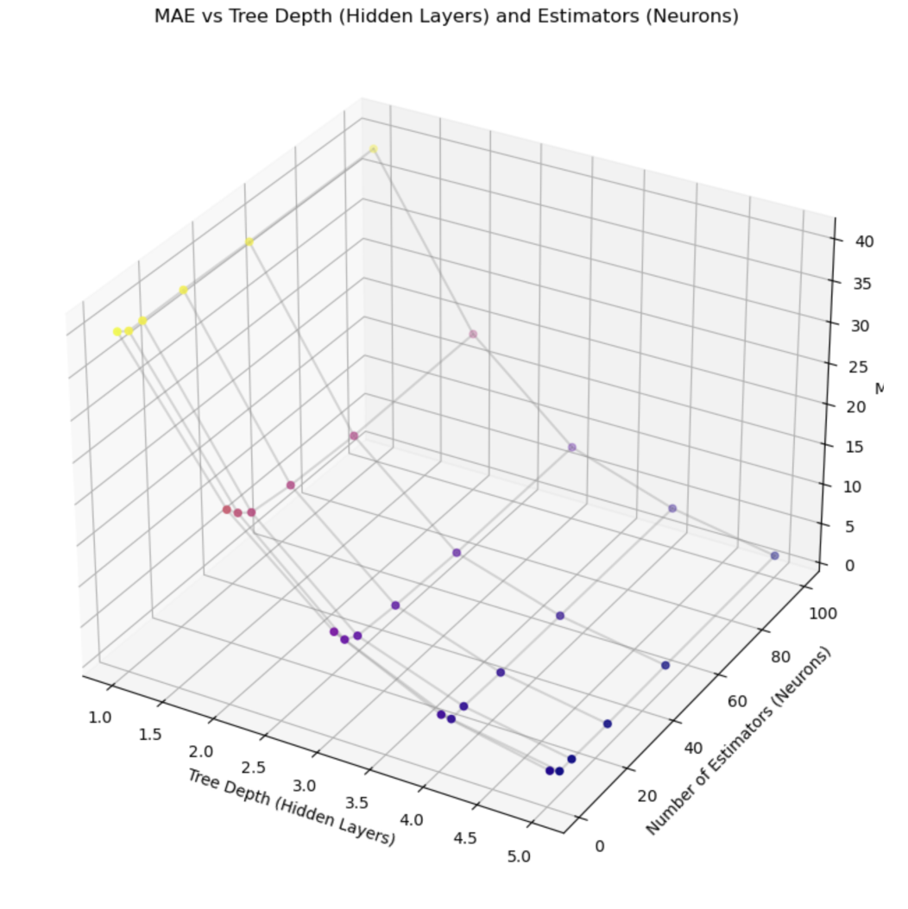
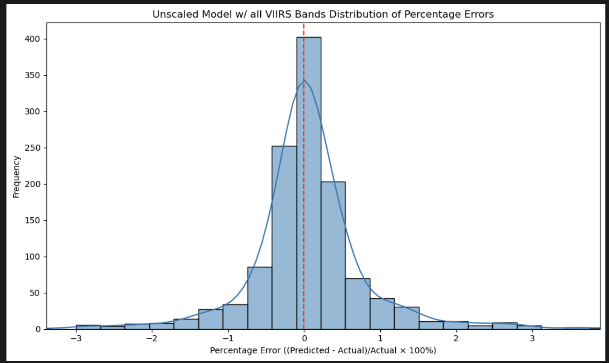

# Radiative Transfer Model Inversion with Machine Learning

#### Skip to the end to learn about package requirements and installation

Project Overview

This project aims to develop machine learning models capable of inverting deterministic radiative transfer processes. The primary goal is to accurately predict unfiltered radiative measurements from filtered measurements using physically meaningful atmospheric and geometric inputs.

The data used in this project is obtained from MODTRAN simulations, which include both shortwave (SW), longwave (LW), and split shortwave (SSW) radiation measurements at various atmospheric conditions and solar geometries.

## Key Components

### Data Processing

The primary data source is TAPE7 files, which contain detailed radiative transfer simulation data. The project uses a custom Python class, Tape7, to parse, process, and structure this data efficiently. The class reads the file, extracts metadata, and organizes the radiance measurements for both SW and LW radiation.

### Radiance Integration

To obtain integrated radiances, the project utilizes a spectral response function (SRF) to filter the radiation measurements. This allows for comparing unfiltered ground truth values against filtered measurements, thereby enabling accurate model training.

### Modeling

The project primarily utilizes Random Forest (RF) regression models. The models are trained to predict unfiltered radiation values from filtered measurements and various atmospheric parameters, including:

* Solar Zenith Angle (SZA)

* Viewing Zenith Angle (VZA)

* Relative Azimuth Angle (RAZ)

* VIIRS bands

MAE is cut off on the right side of the graph

### Model Evaluation

Models are evaluated using Mean Absolute Error (MAE) and Root Mean Squared Error (RMSE) metrics.

Current Results (more metrics available in modeling.ipynb):

### Data Visualization

The project includes extensive visualization of both the raw data and model predictions. This helps identify patterns and evaluate the quality of model outputs. Key visualizations include:

Radiance spectra for SW and LW radiation
* in experiments.ipynb look for the cell RADIANCE GRAPHS, and un comment the functions below

Error distribution plots for model predictions
* available at the bottom of modeling.ipynb

### Usage Instructions

Install the required Python libraries listed in requirements.txt.

Notebook directions for modeling.ipynb are located in the top cell.

** NOTE **
Some packages may only be installed through conda!

if building from the requirements.txt does not work start with pandas, numpy, sklearn, and scipy
* these packages will install a lot of the other packages you need
* and in the order given above will ensure no errors
* IF you use conda follow the instructions at the top of the file

For questions please contact Caleb Kumar.
